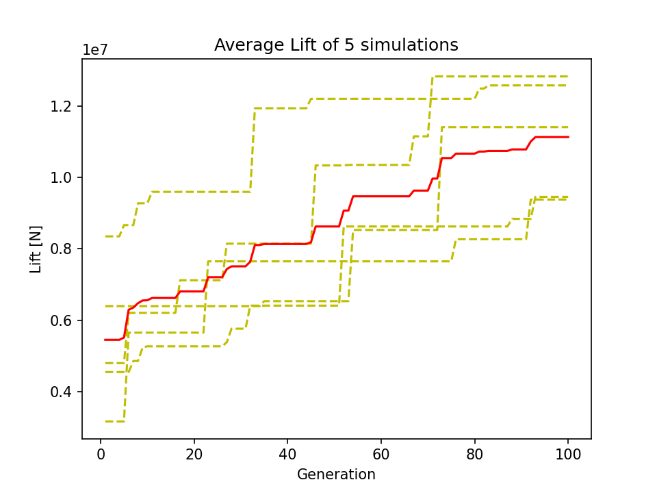

**Radim Urban, Zdeněk Šnajdr, René Čáky**
1. The implementation of the Genetic Algorithm
2. Problem #1 - Optimal allocation of resources
3. Problem #2 - Optimizing the design and conditions for an aircraft
4. Problem #3 - Optimizing the power of an engine

Our complete implementation can be found here: https://github.com/radimurban/opt_methods_project/tree/main 
___
## 1. The (Micro) Genetic Algorithm 

The genetic algorithm is a method for solving optimization problems that is based on natural selection. The genetic algorithm repeatedly improves a population of individuals. At each iteration, the GA selects parents from the current population of individuals (_ranking_), which then produce the children for the next generation (_breeding_) using crossover and mutation (if this is omitted, we talk about *Micro GA*). Over many generations, the population converges to an optimal solution by replacing the weakest individuals by the children.
This process can be easily described using the following flowchart:


To summarize: **Population** is the set of all the **individuals** (also called **chromosomes**). Each chromosome carries some information about itself stored and segmented into **genes**.  
  
We implement the Micro GA on a high level by specifying the necessary aspects of the algorithm.

### Population Initilization 
Random population of $N$ individuals $p_n$ (initialization), where $p_n$ is a bitstring of length $L$.
```java
public Population(int size) {
    individuals = new Chromosome[size];
    random = new Random();
    for (int i = 0; i < size; i++) {
        int[] genes = new int[10];
        for (int j = 0; j < genes.length; j++) {
            genes[j] = random.nextInt(2);
        }
        individuals[i] = new Chromosome(genes);
    }
}
```
### Fitness Function
This is the metric for choosing the parents and individual to be replaced by the child(ren). In this implementation the fitness function is the number of bits in individual that are 1. 

$$
F(p_n) = \sum_{i = 0}^{L-1} p_{n_i} \quad \text{where } p_{n_i} \text{ is the i-th bit in } p_n
$$

```java
private double evaluate(Chromosome individual) {
	// This implementation simply returns the sum of the genes
	int[] genes = individual.getGenes();
	double sum = 0;
	for (int gene : genes) {
		sum += gene;
	}
	return sum;
}
```

### Parents Selection
Generally speaking, there are many ways to select parents. In this simple implementation, we use the tournament methods. To choose one parent, we randomly choose $x$ individuals from the population and select the one with the highest fitness function. 
```java
public Chromosome select(){
  Chromosome best = null;
  for (int i = 0; i < 5; i++) {
      Chromosome individual = individuals[random.nextInt(individuals.length)];
      if (best == null || individual.getFitness() > best.getFitness()) {
          best = individual;
      }
  }
  return best;
}
```

### Children Generation
We choose to implement **one-point crossover**, i.e. randomly generate a midpoint $\in [0;L]$ and generate child by taking bits from *0* to *midpoint* from *parent1* and the rest from *parent2*.

```java
public Chromosome crossover(Chromosome other) {
    int[] childGenes = new int[genes.length];
    int midpoint = random.nextInt(genes.length);
    for (int i = 0; i < midpoint; i++) {
        childGenes[i] = genes[i];
    }
    for (int i = midpoint; i<genes.length; i++) {
      childGenes[i] = other.genes[i];
    }
    return new Chromosome(childGenes);
}
```
We then replace (**updating the population**) this new child with the weakest individual (individual) with the lowest fitness function.
```java
public void replaceWorst(Chromosome child) {
    int worstIndex = 0;
    double worstFitness = Double.MAX_VALUE;
    for (int i = 0; i < individuals.length; i++) {
        if (individuals[i].getFitness() < worstFitness) {
            worstIndex = i;
            worstFitness = individuals[i].getFitness();
        }
    }
    individuals[worstIndex] = child;
}
```
### Stopping Criteria
For this implementation we only simply check pre-defined number of generations (=iterations).

```java
while (generation <= MAX_GENERATIONS) {

    /*
     * Main Algorithm Loop
    */
    
    generation++;
}
```


<div style="page-break-after: always;"></div>

## 2. Optimal allocation of resources

A practical and real-world example of optimizing resource allocation in a supply chain to minimize costs and maximize efficiency could be in the production of a consumer electronics product, such as a smartphone. In this example, the supply chain involves several stages, including the sourcing of raw materials, manufacturing of components, assembly of the final product, and distribution to retailers.
We decided to implement the following micro genetic algorithm to solve the problem of optimal resource allocation to minimize costs and maximize efficiency. In our example we simplify this to determining the optimal number of raw materials to purchase and which products to manufacture from the available resources.


### Population
There are two classes, `Resource` and `Product`. Each population contains $n$ resources and $m$ products. Each resource and product object is represented mainly through a vector (array) with integer entries. This approach is known as **value encoding**. A member of the class `Resource` represents all the resources we can acquire, the total cost of these resources and the fitness score. A product that the company can make is represented by the class `Product`. Each product has information about the selling price and the resources necessary to produce it. The price of a product must be at least the cost of the needed resources (otherwise it does not make sense economically). 
Both of these classes are managed by a `Manager`. The main purpose of the `Manager` class is to make testing easier. You only have to create one `Manager` object with the corresponding arguments and it takes care of all the initialization for you. There is also the possibility to enter the mutation rate for testing purposes to see how a micro genetic algorithm compares to a full genetic algorithm. Each Manager object has all the functions for the (micro)GA algorithm as well as important properties.


### Fitness Function
Each `Resource` is evaluated by a fitness function that assigns a fitness score. Since we live in a capitalist society, **our goal is to maximize the profit while minimizing the cost**. We also want to produce as much as possible so we encourage filling up the warehouse with useful parts. The fitness is computed as follows:

$$ 
F = \frac{\operatorname{maximal\_profit}}{\operatorname{total\_cost}}  (\operatorname{npw} - \operatorname{nu\_penalty})$$

where:
- $\operatorname{npw}$ - **n**umber of **p**arts in the **w**arehouse
- $\operatorname{nu\_penalty}$ - **penalty** for parts **n**ot **u**sed in manufacturing the products

$F$ is the quotient of the profit and the cost. Maximizing the profit or minimizing the cost leads to higher fitness score. Multiplying with the overall available resources penalized with the number of unneeded resources. 
The `evalProfit` function computes the profit from products made out of the available resources. It starts with the most expensive product first and when there are no more enough resources it continues with the next most expensive product. The resources that are not left at the end are not enough to create any of the products and are used as a penalty since the resources have cost but no profit.

```java
public double[] evalProfit(Resource res) {
	Arrays.sort(products, Comparator.comparingDouble(Product::getPrice).reversed());
	double profit = 0.0;
	int[] localCopy = Arrays.copyOf(res.getResources(), res.getResources().length);
	
	for (int i = 0; i < products.length; i++) {
		while(isAvailable(products[i].getNeededResources(), localCopy)) {
			Product product = products[i];
			Arrays.setAll(localCopy, j -> localCopy[j] - product.getNeededResources()[j]);
			profit += product.getPrice();
		}
	}
	double penalty = Arrays.stream(localCopy).sum();
	return new double[]{profit, penalty};
}

private boolean isAvailable(int[] needed, int[] available) {
	assert needed.length == available.length;
	for (int i = 0; i < available.length; i++) {
		if (available[i] - needed[i] < 0) {
			return false;
		}
	}
	return true;
}
```

### Parent Selection
We choose two parents in a **tournament selection** process. Both parents are Resource objects maximizing the fitness function among 5 randomly selected Resources. Selecting one parent will look like this:

```java
public Resource select() {
	Resource best = null;
	for (int i = 0; i < 5; i++) {
		Resource res = resources[random.nextInt(n)];
		if (best == null || res.getFitness() > best.getFitness()) {
			best = res;
		}
	}
	return best;
}
```

### Generating Children
We use **two-point crossover**. For this problem, the multi-point crossover makes more sense than a single point crossover. All the products require different types and amounts of resources and it is better to better to mix up the current values so there is more room for new combinations. The optimal number of crossover points depend also on the nature of the products. As an example, if each product only required one unit of one resource then also a single point crossover could be sufficient. The more intrigue the products get the more you have to adjust the number of crossover points. In the comparison with the standard genetic algorithm this makes sense. For the mGA we can only use the values that we get during the initialization and they cannot be mutated. This also means that a higher number of first generation resources is better (and necessary) for mGA because there are more values to choose from during crossover. For this implementation. it is also necessary to keep track of the new cost and the number of resources. Upon creating the child we check in a do-while loop that the sum of the resources is under the limit.

```java
public Resource crossover(Resource parent1, Resource parent2) {
        int[] childResources = new int[n];
        int crossoverPoint1 = random.nextInt(n);
        int crossoverPoint2 = random.nextInt(n - crossoverPoint1) + crossoverPoint1;
        double varCost = 0.0;
        
        for (int i = 0; i < crossoverPoint1; i++) {
            childResources[i] = parent1.getResources()[i];
            varCost += childResources[i] * prices[i];
        }
        for (int i = crossoverPoint1; i < crossoverPoint2; i++) {
            childResources[i] = parent2.getResources()[i];
            varCost += childResources[i] * prices[i];
        }
        for (int i = crossoverPoint2; i < n; i++) {
            childResources[i] = parent1.getResources()[i];
            varCost += childResources[i] * prices[i];
        }
        
        return new Resource(childResources, varCost);
    }
```

### Sample Results
```
Generation: 0
Best allocation: [12, 14, 7]
Cost: 41.0
Profit: 115.5
Penalty: 5.0
Fitness: 78.8780487804878

Generation: 1
Best allocation: [12, 14, 16]
Cost: 59.0
Profit: 162.0
Penalty: 10.0
Fitness: 87.86440677966101

Generation: 2
Best allocation: [12, 14, 16]
Cost: 59.0
Profit: 162.0
Penalty: 10.0
Fitness: 87.86440677966101
...
...
...
Generation: 98
Best allocation: [12, 14, 16]
Cost: 59.0
Profit: 162.0
Penalty: 10.0
Fitness: 87.86440677966101

Generation: 99
Best allocation: [12, 14, 16]
Cost: 59.0
Profit: 162.0
Penalty: 10.0
Fitness: 87.86440677966101

Generation: 100
Best allocation: [12, 14, 16]
Cost: 59.0
Profit: 162.0
Penalty: 10.0
Fitness: 87.86440677966101
```

<div style="page-break-after: always;"></div>

## 3. Finding the optimal design and conditions for an aircraft
We model this problem as having a few components&conditions for which we want to maximize the lift force. To limit the ranges of the components, we assume we are modeling this problem on an airliner (e.g. Boeing 777 and similar).

### Population
Let's assume that each candidate solution (i.e., *chromosome*) in the population is represented by a vector $p = (V, S, \alpha , e, AR) \in \mathbb{R}^5$ of design variables that define a part of an aircraft. (**Value Encoding**) The dimensions correspond to:

- $V$ is the speed of the aircraft ($m/s$)  $\in [50; 350]$
- $S$ is the wing area ($m^2$)  $\in [60; 200]$
- $\alpha$ is the angle of attack (rad)  $\in [0; 0.43]$
- $e$ is the Oswald efficiency factor  $\in ]0; 1]$
- $AR$ is the wing aspect ratio  $\in [5; 15]$

### Fitness function
Each chromosome is evaluated by a fitness function that computes its performance and assigns a fitness score. In this case we want to compute the maximum lift.

**Lift ($L$):** The lift generated by the plane depends on the air density, the speed of the aircraft, and the geometry of the wing. The lift can be computed using the following formula:

$$
L = \frac{1}{2} \rho V^2 S \frac{(2 \pi \cdot \alpha)}{ (1 + (\pi \cdot e \cdot AR))}
$$

where:
- $\rho$ is the air density (kg/m^3) -> Assume constant at $1.293 kg/m^3$

### Parent Selection
We will choose two parents. Both as chromosome maximizing the fitness function among 10 randomly selected chromosomes (**Tournament Selection**)
Some randomness might make sense because for example of different conditions for the plane (meaning, the chromosome maximizing the fitness function might not maximize it in all conditions). 

Selecting one parent will look like this:

```java
Chromosome best = null;
    for (int i = 0; i < 10; i++) {
        Chromosome individual = individuals[random.nextInt(individuals.length)];
        if (best == null || individual.getFitness() > best.getFitness()) {
            best = individual;
        }
    }
return best;
```

### Generating Children
We generate children as follows. To optimize but also to keep randomness in the process we _randomly_ mix the genes of the two parents. (**Uniform Crossover** with randomly generated bit-mask). Here, *bit-mask* is just a bit-vector determining which parent the child inherits the value from.

```java
public Chromosome[] crossover(Chromosome other) {
    double[] childGenes = new double[genes.length];
    double[] otherChildGenes = new double[genes.length];

    for (int i = 0; i < childGenes.length; i++) {
        boolean mask = random.nextBoolean();

        // Mask bit stays unchanged for both assignments => children inherit from different parents
        childGenes[i] = mask ? this.getGenes()[i] : other.getGenes()[i];
        otherChildGenes[i] = mask ? other.getGenes()[i] : this.getGenes()[i];
        
    }

    Chromosome first_child = new Chromosome(childGenes);
    Chromosome second_child = new Chromosome(otherChildGenes);
    Chromosome[] children = {first_child, second_child};

    return children;
}
```
We then replace the worst individuals (lowest fitness score) with just generated children.
```java
// Crossover
Chromosome[] children = parent1.crossover(parent2);

// Replace x worst individuals with x children
for (Chromosome child : children){
    population.replaceWorst(child);
}
```
### Stopping Criteria
We will pre-define the number of generations we want to optimize over and abort after achieving this number. We observe, that in 9 from 10 runs, the algorithm converges around 75th generation/iteration, i.e. the algorithms settles on a final value at around 75th iteration.

### Sample Results
Following result was obtained by having `POPULATION_SIZE = 150` and stopping criteria constant `MAX_GENERATIONS = 100`.
```
Generation: 1
Best fitness: 8121325.844336658
Generation: 2
Best fitness: 8121325.844336658
Generation: 3
Best fitness: 8121325.844336658
...
...
...
Generation: 73
Best fitness: 9273070.677375384
Generation: 74
Best fitness: 9273070.677375384
Generation: 75
Best fitness: 9273070.677375384
Generation: 76
Best fitness: 1.2647211860884406E7

...
...

Generation: 96
Best fitness: 1.2647211860884406E7
Generation: 97
Best fitness: 1.2647211860884406E7
Generation: 98
Best fitness: 1.2647211860884406E7
Generation: 99
Best fitness: 1.2647211860884406E7
Generation: 100
Best fitness: 1.2647211860884406E7

------Component--------|----Value----

Speed of the aircraift:   345.61
Wing area:                189.95
Angle of attack:          0.41
Oswald eff. factor:       0.12
Wing aspect ratio:        5.29

```
Result is returning the maximized Lift $L$ in *Newtons (N)*. At the end we also extract the parameters for which the fitness function was maximized.

We can reason that the delievered result is somewhat reasonable by realizing that a loaded airplane can weigh _up to_ $600.000 kg$ corresponding rouhgly to needed lift of at least $6MN$. At generation 100, the best configuration has a lift force of roughly $9.5 MN$ (computed average of 10 simulations). Hence in the range of reasonable results. In real life achieving this lift by an airplane might be impossible and also unnecessary - it's more about a half of our computed maximum. Result is coming from simplifying and theoretizing about the components and their ranges.

How quickly the algorithm (in terms of generations) finds increases the found maximum of the list can be seen the following plot of the average lift over 5 independent simulations.



<div style="page-break-after: always;"></div>

## 4. Optimizing the power of an engine

Optimizing the mean effective pressure(MEP), stroke, bore and revolutions per minute to achieve maximal power output of an engine. 

### Population
Let's assume that each candidate solution (i.e., chromosome) in the population is represented by a vector $p = (\operatorname{MEP}, \operatorname{stroke}, \operatorname{bore} , \operatorname{revs})$ of design variables that define a part of an aircraft. The type of encoding used to represent the population in the algorithm is called value encoding, since we have specific values for every gene. The dimensions correspond to:

- $\operatorname{MEP}$ is a measure of the average pressure exerted by the gases in the combustion chamber of an engine during the power stroke. $\in [170; 280]$ measured in $(psi)$
- $\operatorname{Strokelength}$ is the distance that the piston travels in the cylinder between the top dead center (TDC) and the bottom dead center (BDC) positions. $\in [0.27; 0.3]$ measured in $(ft)$
- $\operatorname{Bore}$ is the diameter of the cylinder in which the piston moves $\in [2.9; 3.5]$ measured in $(in)$
- $\operatorname{Revs}$ refer to the number of times an engine's crankshaft rotates in a given period of time.  $\in [0; 1]$ measured in $(rpm)$
For the example we choose a specific range of values that represent the specification of a typical diesel engine. 

### Fitness function
Each member of the population is evaluated using a fitness function that computes the power output of engine. We will predefine the number of cylinders, which is also a part of the formula. In this case we want to the power of an engine (in kW).


$$
Power(p) = \frac{(\operatorname{Number of cylinders}) \cdot \operatorname{MEP} \cdot \operatorname{Strokelength} \cdot (\frac{\pi}{4}) \cdot (\operatorname{Bore}^2) \cdot \operatorname{Revs}}{2 \cdot 33000}
$$


### Parent Selection
We use a Tournament Selection. It involves randomly selecting a subset of individuals from the population (we can choose the tournament size in the function call), and then choosing the best individual from that subset as a parent for the next generation. Here's how this is implemented in the code:

```java
 private static double[] tournamentSelection(double[][] population, double[] fitness, int tournamentSize) {
        int[] tournamentIndices = new int[tournamentSize];

        // Randomly select individuals for the tournament
        for (int i = 0; i < tournamentSize; i++) {
            tournamentIndices[i] = random.nextInt(population.length);
        }

        // Find the fittest individual in the tournament
        int fittestIndex = tournamentIndices[0];
        double fittestFitness = fitness[fittestIndex];
        for (int i = 1; i < tournamentSize; i++) {
            int currentIndex = tournamentIndices[i];
            double currentFitness = fitness[currentIndex];

            if (currentFitness > fittestFitness) {
                fittestIndex = currentIndex;
                fittestFitness = currentFitness;
            }
        }

        // Return the fittest individual
        return population[fittestIndex];
    }

```
### Generating Children

We generate children by randomly mixing up the attributes of parents with the following program (Unifrom Crossover with randomly generated mask):

```java

private static double[] crossover(double[] parent1, double[] parent2) {
        double[] offspring = new double[4];
        for (int i = 0; i < 4; i++) {
            offspring[i] = random.nextBoolean() ? parent1[i] : parent2[i];
        }

        return offspring;
    }
```

### Stopping Criteria & Sample Results
Maximal number of generations will be pre-defined as a stopping criteria.

We ran the program five times with the following fixed parameters: 
- number of cylinders: 4
- constant "c" from the fitness formula: 2 (representing a four-stroke engine)
- tournament size: 5
- number of generations: 100
- and population size: 100
obtaining the following results: 

![[Pasted image 20230614083057.png]]

The effectiveness of the genetic algorithm becomes evident as we observe consistent improvement in the results with each successive generation. On average, we achieve a notable increase to approximately 185kw. However, it's worth noting that the algorithm's convergence rate is relatively slow due to the utilization of a small tournament size.

